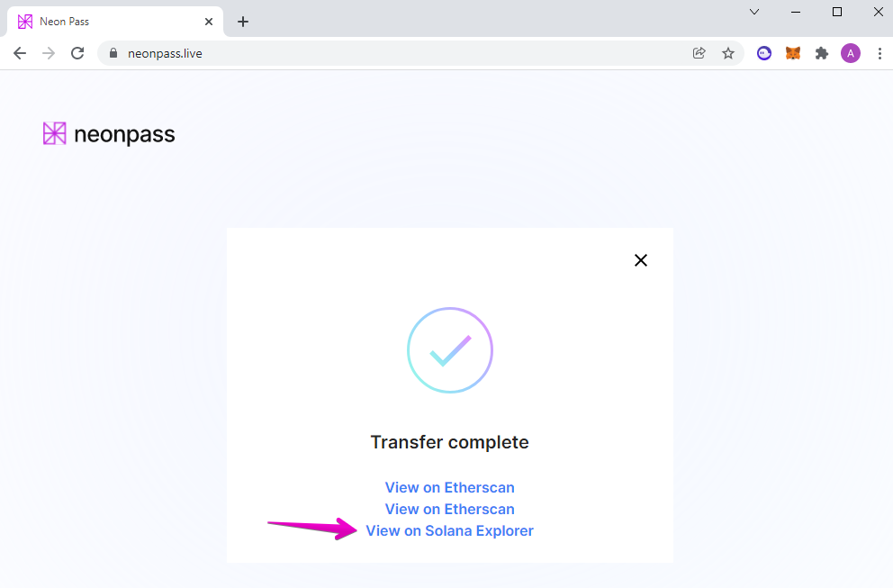

## Overview
This guide provides instructions on how to transfer ERC-20 tokens between Solana and Neon EVM using NeonPass. You can do it in any direction, i.e. transfer tokens from Solana to Neon EVM or withdraw them back. However, you need to keep in mind that each transaction in Neon EVM or Solana will be charged a fee in the form of NEON or SOL tokens, respectively. For example, withdrawing tokens from Neon EVM to Solana requires 2 transactions: one for Neon EVM (requires a fee in NEON) and another for Solana (requires a fee in SOL). Therefore, you will have to pay two fees.

Before you start transferring ERC-20 tokens, you have to fulfill the following requirements:
  * On a source side, you should already have an account with the balance of tokens that will be transferred.
  * NeonPass uses [MetaMask](about/terminology.md#metamask) and [Phantom](about/terminology.md#phantom), two popular non-custodial browser based wallets.
  * The NeonPass application is deployed in the browser to which your wallets are attached.

## Procedure
This procedure presents the example of transferring NEON tokens from Neon EVM to Solana in Devnet. The task is to transfer 42 NEON from Neon EVM to Solana.

Initial conditions:
  * Your Neon EVM account contains a non-zero NEON balance to send, as well as enough to pay the withdrawal approval fee.
  * Your Solana account contains a non-zero SOL-balance to pay the fee.

### 1. Connect Wallets
Go to the [NeonPass](https://neonpass.live/) page in the browser to which the Phantom and MetaMask wallets are attached.

1. Make sure that the icons of these wallets are displayed at the top right.
2. By default, the direction of transferring tokens is set  to be from `Solana` to `Neon`. For this tutorial, click on the arrow icon to reverse the forwarding direction.
3. Click `Connect Wallet` to connect your Phantom wallet to the NeonPass app. The Phantom window should pop up on the screen. Follow the login procedure to your wallet and make sure it is connected to Devnet. Also, make sure you have a non-zero SOL balance to pay the withdrawal approval fee.
4. Click `Connect Wallet` to connect your MetaMask wallet to the NeonPass app. The MetaMask window should pop up on the screen. Follow the login procedure to your wallet and make sure it is connected to Devnet. Also, make sure you have enough NEON tokens in your account to transfer (there are 142 NEON in our example) and have a non-zero NEON balance to pay the withdrawal approval fee.

After successfully connecting your MetaMask and Phantom wallets to NeonPass, the `Connect Wallet` text will change to the name of the chain (Solana or Neon), and the public key of your accounts will be displayed above.

### 2. Select Token
On the NeonPass screen, click `Choose token`. In the list that appears, select the desired token symbol and specify the quantity to be sent (in our example, it is 42 NEON).

### 3. Approve Transaction and Transfer
Click `Transfer` to begin the token transfer procedure. The transaction must then be confirmed in both the MetaMask and Phantom wallet windows which will pop up.

You should then receive a notification that the token transfer was successful. Open the `View on Solana Explorer` page to see the results of transferring funds using NeonPass.

The `Token Balance Change` tab shows the change in balances upon completion of the procedure.

## Conclusion

We examined the use of NeonPass on Devnet using the example of transferring NEON tokens from Neon EVM to Solana. The procedure for reverse transferring tokens from Solana to Neon EVM using NeonPass is not much different from the one given, and therefore we will not explain it here. The main difference will be only in the order of connecting wallets to NeonPass.
