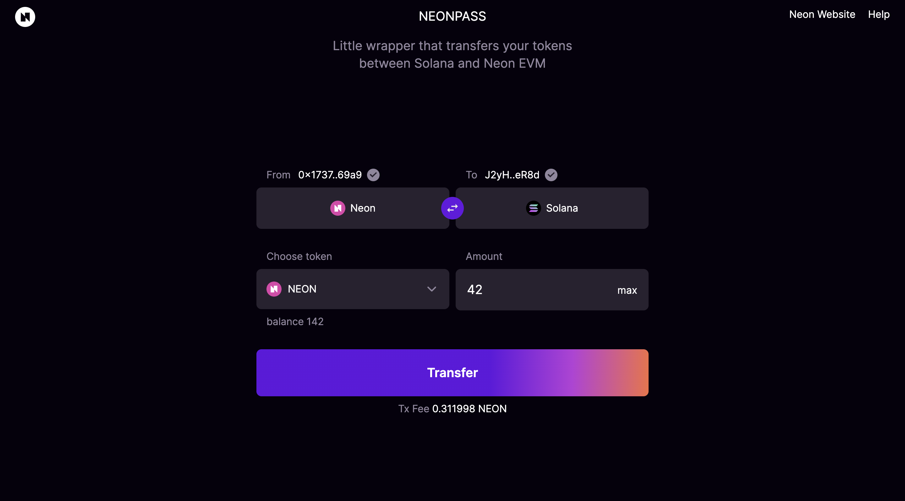

## Overview
This guide provides instructions on how to transfer ERC-20 tokens between Solana and Neon EVM using NeonPass. You can do it in any direction, i.e. transfer tokens from Solana to Neon EVM or withdraw them back. However, you need to keep in mind that each transaction in Neon EVM or Solana will be charged a fee in the form of NEON or SOL tokens, respectively. For example, withdrawing tokens from Neon EVM to Solana requires 2 transactions: one for Neon EVM (requires a fee in NEON) and another for Solana (requires a fee in SOL). Therefore, you will have to pay two fees.

Before you start transferring ERC-20 tokens, you have to fulfill the following requirements:
  * On a source side, you should already have an account with the balance of tokens that will be transferred.
  * NeonPass uses [MetaMask](about/terminology.md#metamask) and [Phantom](about/terminology.md#phantom), two popular non-custodial browser based wallets.
  * The NeonPass application is deployed in the browser to which your wallets are attached.

## Procedure
This procedure presents the example of transferring USDT tokens from Neon EVM to Solana in Devnet. The task is to transfer 5 USDT from Neon EVM to Solana.

Initial conditions:
  * Your Neon EVM account contains a non-zero USDT balance.
  * You have a non-zero NEON balance to pay the withdrawal approval fee.
  * Your Solana account contains a non-zero SOL-balance to pay the fee.

Transferring tokens using NeonPass occurs in three stages:
  * Source — Connecting the MetaMask wallet to NeonPass and providing access to the sender's account balance.
  * Target — Connecting the Phantom wallet to NeonPass and providing access to the recipient's account balance.
  * Confirmation — Signing the transaction and checking the result of transferring tokens.

### The Source Stage

Go to the [NeonPass](https://neonpass.live/) page in the browser to which the Phantom and MetaMask wallets are attached. Make sure that the icons of these wallets are displayed at the top right. By default, the direction of transferring tokens is set from `Solana` to `Neon`. If this is not the case, you have to click on the arrow icon to reverse the forwarding direction.

Click `Connect Wallet` to connect your MetaMask wallet to the NeonPass app. The MetaMask window should pop up on the screen. Follow the login procedure to your wallet and make sure it is connected to Devnet. Also, make sure you have enough USDT tokens in your account to transfer (there are 987.9 USDT in our example) and have a non-zero NEON balance to pay the withdrawal approval fee. Upon successful connection of the MetaMask wallet to NeonPass and access to your account balance, the inscription `Connect Wallet` will change to the public key of your account in the Neon EVM.

On the NeonPass screen, click `Select a token`. In the list that appears, select the desired token symbol and specify the quantity to be sent. (In our example, it is 5 USDT.)

Click `Next` to continue the token transfer procedure and proceed to the Target stage.

### The Target Stage

The `Target` windows will appear on the NeonPass screen. Click `Select Wallet` to connect your Phantom wallet to NeonPass.

The Phantom window should pop up on the screen. Follow the login procedure to your wallet and make sure it is connected to Devnet. Also make sure you have a non-zero SOL balance in your account to pay the fee. (There are 10 SOL in our example.)

Upon successful connection of the Phantom wallet to NeonPass and access to your account balance, the inscription `Select Wallet` will change to the public key of your account in Solana. This means that a user authorizes NeonPass to use this key to sign transactions. Phantom stores sets of account keys, but does not store any balances. To obtain balances, Phantom will refer to the Solana blockchain.

Click `Next` to continue the token transfer procedure and proceed to the Confirmation stage.

### The Confirmation Stage

Read the details of the upcoming transfer of tokens and click `Confirm`.

The MetaMask window will pop up on the NeonPass screen with the amount of fee charged for using gas in Neon EVM. The fee is paid in NEON tokens. If you agree with these terms, click `Confirm`. The transaction will be signed automatically with the public key of your Neon EVM account.

You should also approve the transaction in the Phantom window, which will display the amount transferred and fee charged in SOL tokens. The transaction will be signed automatically with the public key of your Solana account.

You should receive a notification that the token transfer was successful. Open the `View on Solana Explorer` page to see the results of transferring funds using NeonPass.

The `Token Balance Change` tab shows the change in balances upon completion of the procedure.

## Conclusion

We examined the use of NeonPass in Devnet using the example of transferring USDT tokens from Neon EVM to Solana. The procedure for reverse transferring tokens from Solana to Neon EVM using NeonPass is not much different from the one given, and therefore we do not consider it here. The main difference will be only in the order of connecting wallets to NeonPass.
