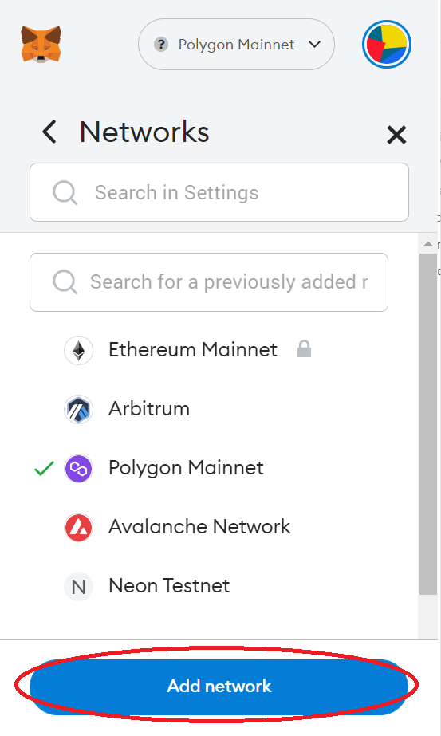
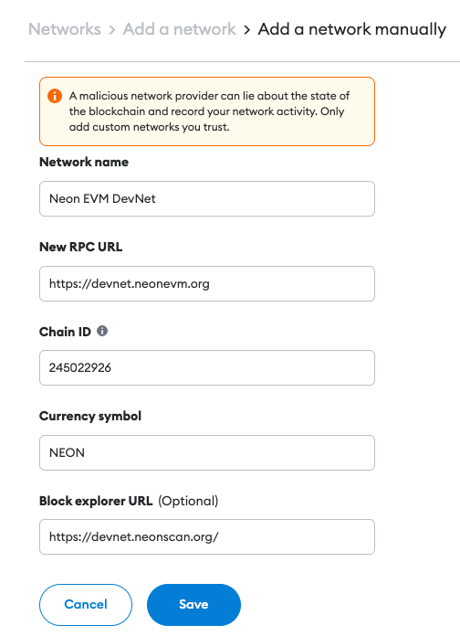

MetaMask wallet is a convenient and fairly easy-to-use application for storing Ethereum addresses and private keys.

## Goal

To install the MetaMask on your device to connect the wallet to the Solana Testnet environment.  

## Device requirements

A browser which supports the MetaMask must be installed on your device. You can use *Chrome*, *Opera*, *Firefox*.  

> Although this tutorial uses the *Ubuntu* platform, the instructions provided can be applied to other platforms.  

## Installing MetaMask

### Step 1
Go to the MetaMask [download page](https://metamask.io/download.html). From there, select any platform you use and follow the instructions to load and install MetaMask your device's browser. (Fig. 1 shows an example of installing the MetaMask on the Chrome browser.)  

Fig. 1 — Loading MetaMask

### Step 2
MetaMask is essentially a plugin in the form of an extension to a browser. Therefore, MetaMask can be added to your browser as an extension. In the window, as shown in Fig. 2, click `Add extension`.  

Fig. 2

When the MetaMask extension is installed, a fox's face (MetaMask’s logo) will appear in the upper left corner of the web browser window. This means that you have successfully installed MetaMask on your device and can start using.

### Step 3
Create a wallet if you don't already have one. MetaMask offers a choice of two options for creating an account:  
* Import an existing wallet using a 12-word passphrase.
* Create a new wallet.

Go ahead and `Create a Wallet`. On the support page `Help Us Improve MetaMask` click `I agree`.  
The password generation form should open on the display. Enter a secret code that must contain at least 8 symbols.  
A secret phrase will be generated automatically. Record the secret phrase for backup (preferably not on a device connected to the Internet). Without this phrase, your funds cannot be refunded if your device is damaged or lost. Confirm that you have written them down on the next page.  

After that, you should see your wallet linked to your account.

## Setting up an RPC network

You can use your wallet to interact with the Solana cluster via a proxy server. To do this, you need to configure your wallet to the desired proxy server.  
Depending on the tasks to be solved, as well as on the location of the proxy and Solana, there are 3 options for setting up the MetaMask wallet:  

  * *Option 1:* Both the proxy and Solana are hosted on remote servers.
  * *Option 2:* The proxy is hosted locally, Solana is on a remote server.
  * *Option 3 (debug mode):* Both the proxy and Solana are hosted locally.

### Step 4
In the upper-right corner, click the red apple view element. Select settings from the dropdown menu to connect to the proxy server (Fig. 3).  

Fig. 3 — Select "Settings" from the dropdown menu

The dropdown menu elements:
* `My Accounts`: list of accounts created by your wallet.
* `Account 1`: account of your wallet that was created during the MetaMask installation; this account provides management of your wallet.
* `Create Account`: this allows you to create one more account to interact with the new proxy server; you can configure this wallet to interact with multiple proxy servers.
* `Import Account`: this allows you to import your private key generated and saved previously into this wallet and use it in the future.
* `Connect Hardware Wallet`: this allows you to save the private key to an external device (i.e. flash memory) located outside the network, thereby increasing the security of your private key.
* `Settings`: used to change the default values; by default, the wallet is configured for Ethereum addresses, including those that you can’t use.

### Step 5
Click `Settings` in the dropdown menu. The window with settings menu for selecting a network should open (Fig. 4).  

Fig. 4 — Choosing a Network

### Step 6
Add a Network (Fig. 5).  

Fig. 5 — The Networks menu

The new window contains the settings for 6 default subnets. You need to use these settings to connect to the desired proxy. Click `Add Network` in the top-right corner.  

### Step 7
Fill in the fields on the next page (Fig. 6):  
* `Network Name`: "remote proxy — solana devnet"
* `New RPC URL`: https://proxy.devnet.neonlabs.org/solana
* `Chain ID`: 245022926
* `Currency Symbol`: NEON
* `Block Explorer URL (optional)`: URL of the block browser

> **Note:** The `Chain ID` is specified for [Testnet](https://docs.solana.com/clusters#testnet). To choose [Devnet](https://docs.solana.com/clusters#devnet) or [Mainnet](https://docs.solana.com/clusters#mainnet-beta) in this field, you need to specify the value *245022926* or *245022934*, respectively.

The wallet settings depend on the values given for the option mentioned above.  

Fig. 6 — Fill the Fields

### Step 8

Click `Save` to keep the settings.  
Your MetaMask wallet has been successfully installed and is ready to use.
